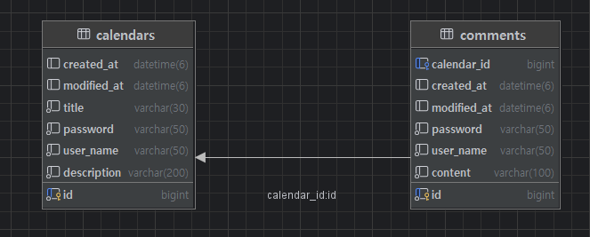

# API 명세서
## calendar table
## 1. 일정 생성
Method : POST
EndPoint : http://localhost:8080/calendars

RequestBody

json
{
    "title" : "계획짜기",
    "description" : "26년 계획짜기",
    "userName" : "홍길동",
    "password" : "1234"
}
Response (201 Created)
json
{
    "id" : 1,
    "title" : "계획짜기",
    "description" : "26년 계획짜기",
    "userName" : "홍길동",
    "createdAt": "2025-12-31T12:00:00",
    "modifiedAt": "2025-12-31T12:00:00"
}

## 2. 전체 일정 조회
Method : GET
EndPoint : http://localhost:8080/calendars
RequestParam : userName(필수가아님)
Response

json
[
    {
        "id": 2,
        "title": "과제하기",
        "description": "코드작성",
        "userName": "홍길동",
        "createdAt": "2025-12-31T14:20:00",
        "modifiedAt": "2025-12-31T15:30:00"
    },
    {
        "id" : 1,
        "title" : "계획짜기",
        "description" : "26년 계획짜기",
        "userName" : "홍길동",
        "createdAt": "2025-12-31T12:00:00",
        "modifiedAt": "2025-12-31T12:00:00"
    }
]

## 3. 선택 일정 조회
Method : GET
EndPoint : http://localhost:8080/calendars{id}
Path Variable : id(고유 식별자)

Response (200 OK)
 
json
{
   "id" : 1,
   "title" : "계획짜기",
   "description" : "26년 계획짜기",
   "userName" : "홍길동",
   "createdAt": "2025-12-31T12:00:00",
   "modifiedAt": "2025-12-31T12:00:00"
   "comments":[
    {
        "id": 1,
        "userName": "안녕하세요",
        "content": "홍길동",
        "createdAt": "2026-01-02T11:15:46.121735",
        "updatedAt": "2026-01-02T11:15:46.121735"
        }   
    ]
}

## 4. 일정 수정
Method : PUT
EndPoint : http://localhost:8080/calendars{id}
Path Variable : id(고유 식별자)

json
Request Body   
{
    "title": "계획짜기 (수정)",
    "userName": "김철수",
    "password": "1234"
}

Response (200 OK)

json
{
    "id" : 1,
    "title" : "계획짜기 (수정)",
    "description" : "26년 계획짜기",
    "userName" : "홍길동",
    "createdAt": "2025-12-31T12:00:00",
    "modifiedAt": "2025-12-31T12:00:00"
}

## 5. 일정 삭제

Method : DELETE
EndPoint : http://localhost:8080/calendars{id}
Path Variable : id(고유 식별자)

Request Body

json
{
    "password": "1234"
}

Response (200 OK)

## content table
## 댓글생성
Method : POST
EndPoint : http://localhost:8080/calendars/{calendarsId}/content

RequestBody

json
{
"content": "안녕하세요",
"userName": "홍길동",
"password": "1234"
}
Response (201 Created)
json
{
"id": 1,
"userName": "안녕하세요",
"content": "홍길동",
"createdAt": "2026-01-02T10:50:25.2654851",
"updatedAt": "2026-01-02T10:50:25.2654851"
}

## ERD

## POSTMAN 결과

